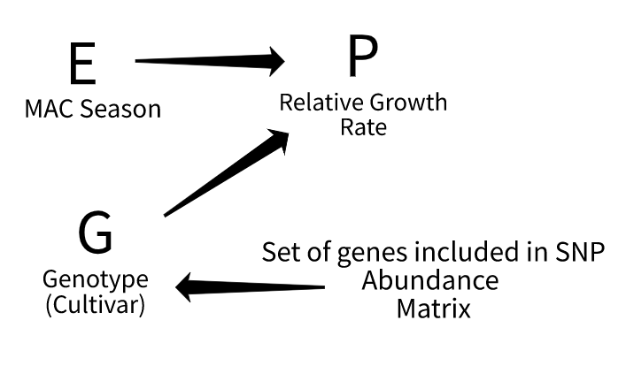

# *Sorghum bicolor bicolor* Phenophase Bayesian Belief Network in R & Python

This project uses:

  - [Rocker Group](https://github.com/rocker-org)'s Tidyverse R 4.0 Ubuntu 18 LTS docker container image
  - data from the [TERRA-REF project](https://www.terraref.org/) accessed through the [traits](https://docs.ropensci.org/traits/) R package
  - [jags](https://mcmc-jags.sourceforge.io/) for Gibbs Sampled MCMC modeling
  - [causalnex](https://causalnex.readthedocs.io/en/latest/) to implement the `NO TEARS` directed acyclic graph structure learning algorithm as described [here](https://github.com/xunzheng/notears)
  - `causalnex` has dependencies: `pandas`, `sklearn`, and `igraph`

To develop a causal Bayesian network, also known as a Bayesian Belief Network,  predicting growth rate as a phenotype from the  *Sorghum bicolor* biomass accumulation panel.

This analysis produces a casual inference Bayesian Belief Network similar to Judea Pearle's [work](https://escholarship.org/content/qt53n4f34m/qt53n4f34m.pdf), where the nodes (vertices) of the network represent variables and the edges (arcs) represent linked dependencies supported by [conditional probailities](https://en.wikipedia.org/wiki/Conditional_probability#:~:text=In%20probability%20theory%2C%20conditional%20probability,or%20evidence%20has%20already%20occurred).

---

## Methods
### Docker Setup

To run any aspect of this analysis it is recommended that you have [Docker](https://www.docker.com/) installed on the host machine. Or use [singularity-ce](https://github.com/sylabs/singularity/releases) to run the containers on high performance clusters.

### Running the Analyses with Docker

- All RScripts detailed below can be run with the container image [cyversevice/rstudio-bayes-cpu:4.0-ubuntu-jags](https://hub.docker.com/layers/cyversevice/rstudio-bayes-cpu/4.0-ubuntu-jags/images/sha256-5a9b4017fd234bf007e556da07c5eee58ad5a4d3c5d429529a731241afe2365c?context=explore), including the [growth rate modeling](https://github.com/genophenoenvo/JAGS-logistic-growth) 
- All python code will run in the command line with this Docker container [image](https://hub.docker.com/r/rbartelme/pytorch-causalnex) and is written so that this repository is mounted as a volume in the container image as `/work/phenophasebbn/` 
  * Ex. `docker run --rm -it -v /local/path/to/phenophasebbn/:/work/phenophasebbn/ rbartelme/pytorch-causalnex:0.10.0 python /work/phenophasebbn/bbn/bbn_structure.py` (See note below)
  * The current Dockerfile for this image is contained in this repository at `/causal_nex/Dockerfile`
- A JupyterLab Docker container [image](https://hub.docker.com/r/rbartelme/jupyterlab-pytorch-causalnex) has been created to facilitate the exploration of the python codebase 

---

### Initial Graph Embedding

In order to speed up the directed acyclic graph generation for the Bayesian Belief Network, an initial graph was instantiated using lists of tuples that reference the edge/node connections and directions outlined in the conceptual diagram above.

***NOTE:*** **Learning the graph structure without any expert knowledge graph encodings via the [NO TEARS](https://github.com/xunzheng/notears) implementation in [causalnex](https://causalnex.readthedocs.io/en/latest/) *without* GPU acceleration is a computationally intensive process and may not solve the graph structure with the Sorghum gene data included in these analyses.**

---

### Network Workflow Description

How the contents of this repository were used to generate the analysis.

**1. Processing raw data:**
  - Weather & phenotype data processing:
    * Code: `/bnprocess_functional.R`
    - Exports (TSV): 
      * `/season4_combined.txt`
      * `/season6_combined.txt`
      * `/ksu_combined.txt` (No longer used in final analysis)
  - Genomic Data:
    * Code to process the SNP frequency by *Sorghum bicolor* gene table [from this repository](https://github.com/genophenoenvo/genomic_data) can be found in `/genomic_preprocessign/snp_normalization.R`
    - Exports (TSV):
      * `/genomic_preprocessing/genewise_snp_relative_abundance.txt` where the relative abundance of single nucleotide polymorphisms is calculated relative to the *Sorghum bicolor* biomass accumilation panel population
  - Development work: 
    * notes and pseudo code are in `/sandbox/` and `/bnprocess_mac.R`

**2. Model Growth Rate by *Sorghum bicolor* Cultivar using JAGS in R:**
  - `/jags/` contains the dev code for the growth rate modeling below, these scripts & files are used in the `bbn` structure learning model
  - Full [logistic growth rate modeling by Jessica Guo](https://github.com/genophenoenvo/JAGS-logistic-growth)
  - Summary plots of the logistic growth models can be found in `/data_figs/`
 
**3. Prepare dataset for structure learning in R & Python:**
  - Join genomic, environmental, and phenotypic data
    * This is done with the Rscript `/bbn/join_datasets.R`
  - Exports:
    * `/bbn/rgr_snp_joined.csv`

**4. BBN Structure Learning in Python with NO TEARS algorithm:**
  - Ingest joined data `/bbn/rgr_snp_joined.csv` and learns structure  with:
    * `/bbn/bbn_structure.py`
  - Process categorical data with `labelencoder` from `scikit-learn`
  - Encode expert knowledge into graph structure via a list of tuples in the first invocation of `StructureModel()`
    * `png` exported as `/bbn/init_graph.png` (as of 10-25-2021 this takes a long time to write the png and is commented out)
  - Improve graph structure with `NO TEARS` using the `from_pandas` function from `causalnex` blacklisting spurrious node + edge connections with a second list of tuples
  - Exports:
    * categorical label encodings for `genotype` (or cultivar) `/bbn/genotype_map.json` & `/bbn/season_map.json`
    * pickle of structure model as `/bbn/nt_sm`
    * `png` of directed acyclic graph as `/bbn/final_graph.png`

**5. Discritized Data Mapping & Conditional Probability Distribution Fitting:**
  - Import Bayesian Network by structure model pickle
  - Instantiate Bayesian network with `BayesianNetwork()` function from `causalnex`
  - Map continuous variables into categories
  - 

